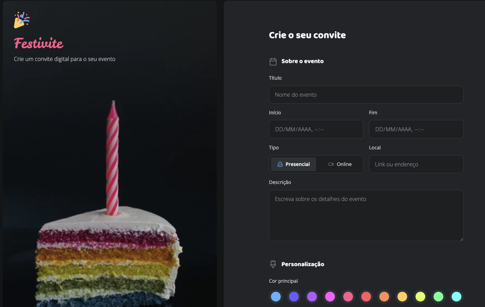

# 📝 Desafio - Formulário de Convite

Este é um projeto desenvolvido como parte de um desafio prático proposto durante os estudos de HTML e CSS com a rocketseat. A proposta era criar um **formulário de criação de convite para eventos**, com foco em semântica e boas práticas de marcação.

---

## 📸 Prévia

  

---

## 🚀 Tecnologias utilizadas

- HTML5
- CSS3 (Flexbox, nome de variáveis, custom scrollbar, grid e etc...)
- SVG para ícones

---

## 🎯 Funcionalidades

- Formulário com campos:
  - Título do evento
  - Data de início e fim
  - Tipo do evento (Presencial ou Online)
  - Local (Endereço ou link)
  - Descrição
- Ícones decorativos para melhorar a usabilidade
- Layout responsivo (em progresso)
- Scrollbar customizada

---

## 🧠 Aprendizados

- Prática com `fieldset`, `legend` e `label` para formulários acessíveis
- Melhora na organização de classes e semântica HTML
- Uso de `flexbox` para estrutura de layout
- Aplicação de `scrollbar-color` e `scrollbar-width` no CSS
- E várias outras técnicas... 🤩
